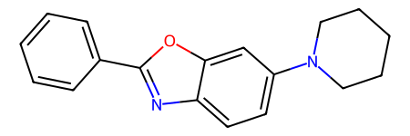
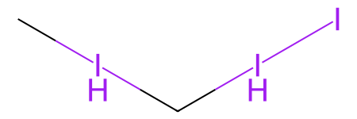
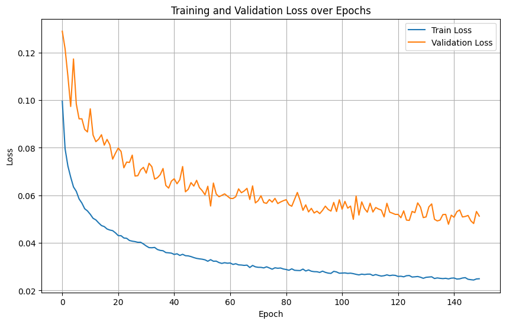

# Fluorescent Molecule Property Prediction with Graph Neural Networks

## Project Overview

This project uses Graph Neural Networks (GNNs) and other machine learning models to predict the photophysical properties of fluorescent molecules. The goal is to accelerate the discovery of new materials for applications like OLEDs, bio-imaging, and sensors. This repository focuses on the property prediction part of a larger thesis project, which also involves fine-tuning generative models to create novel molecules.

The primary goal is multi-task regression to predict the following properties from a molecule's chromophore and solvent:
-   Absorption Maximum (nm)
-   Emission Maximum (nm)
-   Fluorescence Quantum Yield
-   Fluorescence Lifetime (ns)

The core of the project is a hybrid model that processes chromophores as molecular graphs and solvents using their chemical fingerprints.

Here, we provide an example of a chromophore and its solvent from the training set:

<p align="center">
  
  
</p>

## Features

-   **GNN-based Models**: Implements several GNN architectures, including GCN, GIN, and GAT, located in [`models/model.py`](models/model.py).
-   **Hybrid Featurization**: Uses `deepchem` to create graph representations for chromophores and RDKit's Avalon fingerprints for solvents. See the featurization process in [`dataset/preprocess.py`](dataset/preprocess.py).
-   **Multi-Task Learning**: Predicts four distinct molecular properties simultaneously.
-   **Dynamic Loss Function**: Employs a custom loss function, [`LossWithMemory`](utils/utilities.py), which dynamically weights the loss for each target during training. This helps to handle missing data points, a common challenge in this dataset.
-   **Configurable Pipeline**: All training parameters, paths, and model settings are managed through a central configuration file at [`configs/default_config.yaml`](configs/default_config.yaml).
-   **Training and Evaluation**: Includes a streamlined script [`scripts/train.py`](scripts/train.py) for training a model from scratch and evaluating its performance using Mean Squared Error (MSE) and R² metrics.
- **Data Pre-processing Pipeline**: Performs log-transformation on features with varying scales, such as luminescence lifetime, to normalize their distributions.

## Project Structure

```
.
├── configs/              # Configuration files (e.g., default_config.yaml)
├── dataset/              # Data loading and preprocessing scripts
├── models/               # GNN model definitions
├── notebooks/            # Jupyter notebooks for experimentation and analysis
├── saved_models/         # Saved model weights and training history
├── scripts/              # Main scripts for training and evaluation
└── utils/                # Utility functions for loss, metrics, etc.
```

## Setup and Installation

1.  **Clone the repository**
2.  **Create a virtual environment** (recommended)
    ```bash
    python -m venv venv
    source venv/bin/activate  # On Windows use `venv\Scripts\activate`
    ```
3.  **Install dependencies**: You will need libraries like PyTorch, PyTorch Geometric, RDKit, DeepChem, and scikit-learn.
    ```bash
    pip install torch torchvision torchaudio
    pip install torch-geometric
    pip install deepchem rdkit-pypi scikit-learn pyyaml
    ```

## Usage

### 1. Configuration

Adjust the training and model parameters in [`configs/default_config.yaml`](configs/default_config.yaml). You can modify the learning rate, batch size, number of epochs, and data paths.

### 2. Data

Place your dataset (e.g., `prep2.csv`) in the path specified by `dataset_path` in the config file (default is `dataset/processed`). The dataset should be a CSV file containing SMILES strings for the 'Chromophore' and 'Solvent', along with columns for the target properties.

### 3. Training

To start the training process, run the main training script. The script will automatically handle data splitting, preprocessing, training, and validation.

```bash
python scripts/train.py
```

The best model weights will be saved to the path specified by `model_save_path` in the config, and the loss history will be stored in a corresponding `.json` file.

### 4. Evaluation

The `test_model` function in [`scripts/train.py`](scripts/train.py) is called after the main script execution. It loads the best saved model and evaluates it on the test set, printing the final MSE and R² scores for each target. To run only the evaluation, you can comment out the `mlt_graph_training()` call in the script.

## Model Training

The model is trained using a custom loss function, which is a sum of the Mean Squared Error (MSE) for each of the predicted features. To address the challenge of missing data points, a `LossWithMemory` approach is used. This dynamically weights the loss for each target based on its performance in previous epochs, ensuring that the model learns effectively from the available data.

Below is a visualization of the training and validation loss over epochs:

<p align="center">
  
</p>

## Results

Our GNN models achieved strong performance on their own. The table below shows the results for a GNN-only approach:

| Target Feature  | Model | R^2   | MAE     |
|-----------------|-------|-------|---------|
| Absorption max  | GNN   | 0.942 | 16.647  |
| Emission max    | GNN   | 0.904 | 20.311  |
| Quantum yield   | GNN   | 0.689 | 0.114   |
| Lifetime        | GNN   | 0.707 | 0.333   |

By incorporating the GNN predictions as features within an ensemble of models (including XGBoost), we were able to achieve state-of-the-art results for this dataset:

| Target Feature  | Model               | R^2   | MAE     |
|-----------------|---------------------|-------|---------|
| Absorption max  | Ensemble learning   | 0.956 | 13.462  |
| Emission max    | Ensemble learning   | 0.901 | 20.412  |
| Quantum yield   | Ensemble learning   | 0.733 | 0.112   |
| Lifetime        | XGBoost Regressor   | 0.750 | 0.314   |

This example shows the predicted properties from our de-novo generated molecules:

| Chromophore | Solvent | Absorption max | Emission max | Quantum yield | Lifetime (ns) |
| :--- | :--- | :--- | :--- | :--- | :--- |
| `COc1ccc(N2CCN(c3ccc4nc(-c5ccc(N(C)C)cc5)oc4c3)CC2)cc1` | `CICII` | 458.72644 | 517.27563 | 1.000 | 109.97374 |
| `CCN(CC)c1ccc(-c2nc3cc(/C=C/c4ccc(C)cc4)ccc3o2)cc1` | `CICII` | 515.5474 | 587.9956 | 0.9483274 | 47.525497 |
| `Cc1cc(C)n2c1C=C1c3cc(N(C)C)ccc3C(c3ccc(O)cc3)=[N+]1[B-]2(F)F` | `CICII` | 411.62762 | 513.18585 | 0.94702464 | 244.78694 |
| `COc1cc(C2=[N+]3C(=Cc4c5ccccc5c(-c5ccccc5)n4[B-]3(F)F)c3nc4ccccc4cc32)ccc1O` | `CICII` | 428.78024 | 608.7465 | 0.9154229 | 196.98175 |
| `COc1cc(/C=C/c2ccc(N(C)C)cc2)ccc1-c1nc2ccccc2o1` | `CICII` | 374.19922 | 461.71155 | 0.8876498 | 94.89495 |
| `c1ccc(-c2nc3ccc(N4CCCCC4)cc3o2)cc1` | `CICII` | 421.28857 | 497.51483 | 0.8632416 | 92.515274 |
| `COc1cc(OC)cc(C2=[N+]3C(=Cc4c5ccccc5c(-c5ccccc5)n4[B-]3(F)F)c3ccc4ccccc4c32)c1` | `CICII` | 368.9753 | 444.6679 | 0.86099166 | 149.97249 |
| `COc1cc(C2=[N+]3C(=Cc4c5ccccc5c(-c5ccccc5)n4[B-]3(F)F)c3ccc4cc(Br)ccc4c32)ccc1O` | `CICII` | 447.32825 | 594.4784 | 0.85182315 | 93.6159 |
| `CCN(C)c1ccc2c(c1)C(c1ccc(N(C)C)cc1)=[N+]1C2=Cc2c(C)cc(C)n2[B-]1(F)F` | `CICII` | 417.13477 | 478.60864 | 0.84852964 | 206.50757 |
| `CCc1ccc(C2=C3c4ccccc4C(c4ccc5ccccc5c4)=[N+]3[B-](F)(F)n3cccc32)cc1` | `CICII` | 578.72675 | 595.71545 | 0.82670295 | 146.03694 |

